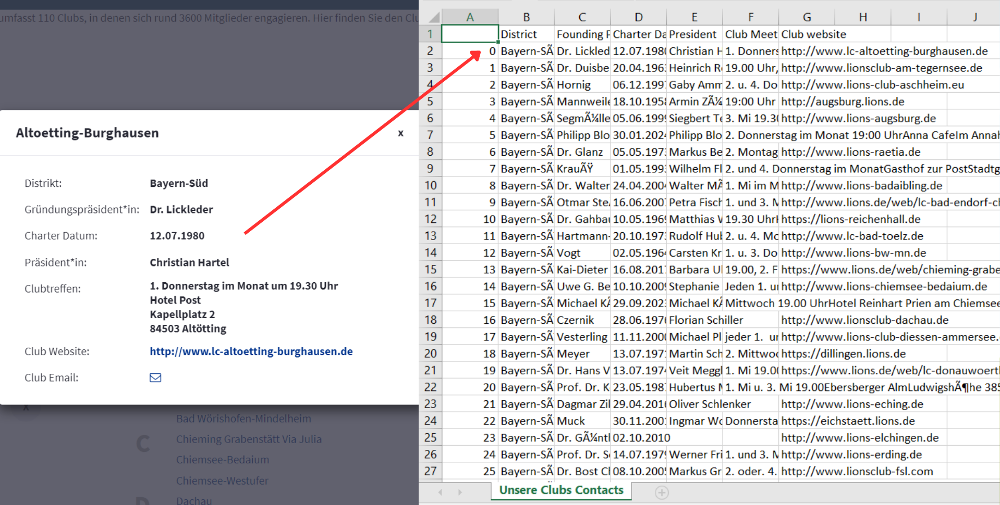

# Web-Scraping-Contact-of-Germany-Clubs

To get the intended information, I need to do a repetitive task as I need to click on each of the club's name. So I used Selenium to automate this process. I am using python programming to scrap this data with the help of Beautiful Soup to get the value from the HTML text. Then I am using pandas to create the resulting data and save it in a CSV file format. It is pretty straight forward task. I completed this task for nearly 3 hours long.

